# Procesverslag
Markdown is een simpele manier om HTML te schrijven.  
Markdown cheat cheet: [Hulp bij het schrijven van Markdown](https://github.com/adam-p/markdown-here/wiki/Markdown-Cheatsheet).

Nb. De standaardstructuur en de spartaanse opmaak van de README.md zijn helemaal prima. Het gaat om de inhoud van je procesverslag. Besteedt de tijd voor pracht en praal aan je website.

Nb. Door *open* toe te voegen aan een *details* element kun je deze standaard open zetten. Fijn om dat steeds voor de relevante stuk(ken) te doen.

## Jij

  
uitwerken voor kick-off werkgroep

  ### Auteur:
  Karenza de Koop

  #### Je startniveau:
  Blauw 

  #### Je focus:
  Responsive
 

## Je website

  
uitwerken voor kick-off werkgroep

  ### Je opdracht:
  https://trainmore.nl 

  Trainmore is een sportschool in Nederland met heel veel verschillende vestegingen.
  Hun motto is: " Een gym die je helpt om alles uit het leven te halen." 

  #### Screenshot(s) van de eerste pagina (small screen): 
  Homescreen 
  

  #### Screenshot(s) van de tweede pagina (small screen):
  Personal training 
  
 

## Toegankelijkheidstest 1/2 (week 1)

  
uitwerken na test in 2e werkgroep

 Tijdens dit test process heb ik een paar dingen uitgevonden. De screenreader test ging goed maar de Trainmore website is niet zo toegankelijk als ik dacht. De headings zijn niet allemaal duidelijk en geven niet altijd aan waar de content over gaat. Ze gebruiken vaak headings als grote, dikgedrukte text en dat zorg voor verwarring voor de screenreaders gebruikers. De links zijn allemaal wel duidelijk en lezen dit goed voor. 
  Daarna zijn we de WCAG-test gaan doen en dit heeft heel duidelijk aangegeven dat de website niet toegankelijk is.
  veel html elementen zijn niet goed aangegeven en de media op de website is leuk maar niet handig voor toegeankelijkheid. 
  Conclusie is dat er nog best veel gedaan moet worden om dit website toegankelijk te maken.

  ### Bevindingen
  - Headings zijn niet duidelijk aangegeven 
  - Html moet netter geschreven worden
  

## Breakdownschets (week 1)

  
uitwerken na afloop 3e werkgroep

  ### de hele pagina: 
  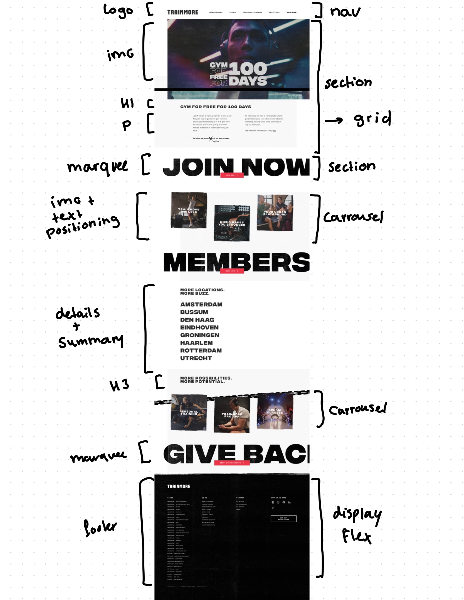

  ### dynamisch deel (bijv menu): 
  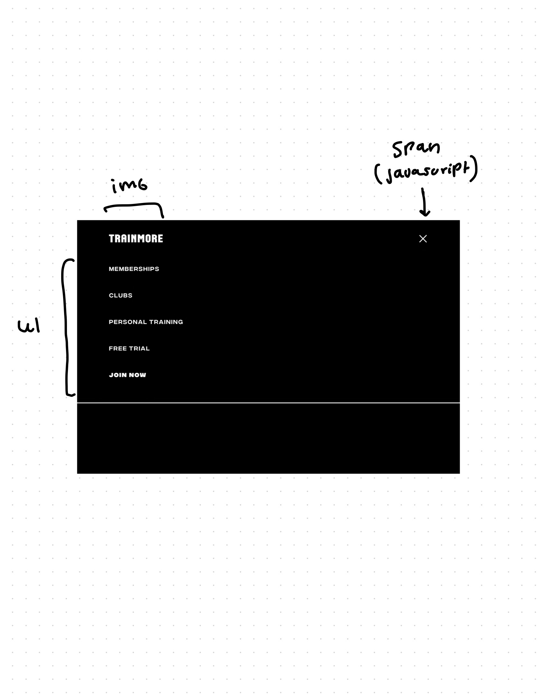

  ### wellicht nog een dynamisch deel (bijv filter): 
  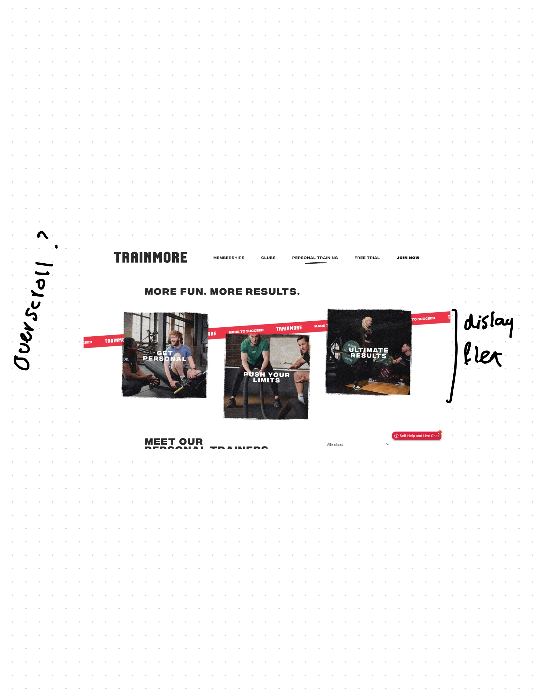

## Voortgang 1 (week 2)

  
uitwerken voor 1e voortgang

  ### Stand van zaken
  Ik was meteen begonnen aan de HTML van de website. Ik vin HTML persoonlijk best makkelijkdus had niet veel moeite met het opzet van "nette" html. Had alleen wat vragen die ik wilde stellen maar dat ging over kleine dingen zoals "att atributes" en "hoe je het beste hidden headers kan gebruiken. Voorderest gebruik ik verschillende sections om de site goed op te delen en maak gebruik van header main en footer om later makkelijker te selecteren. 

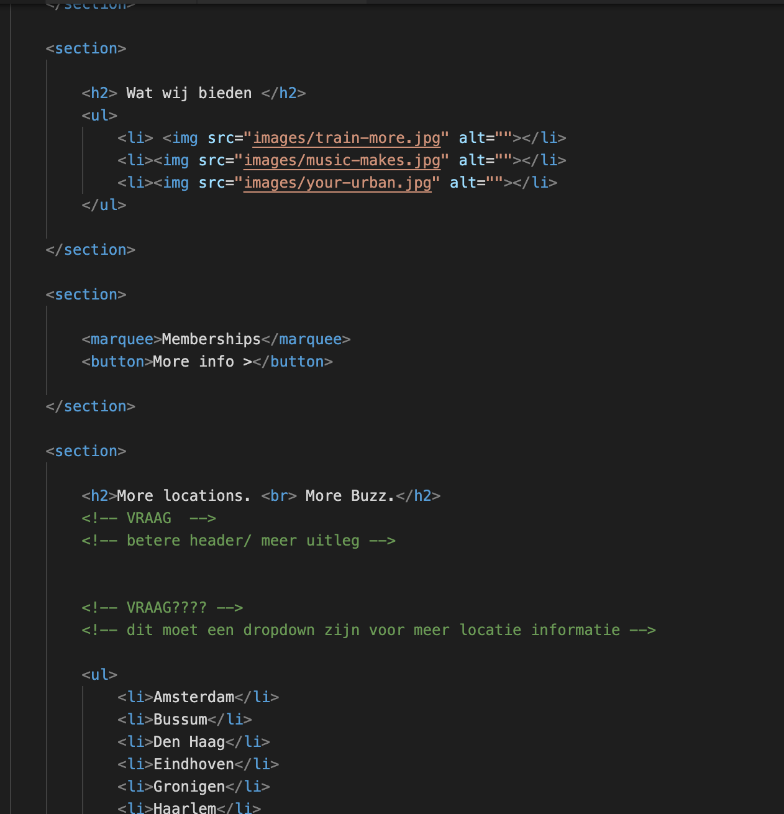
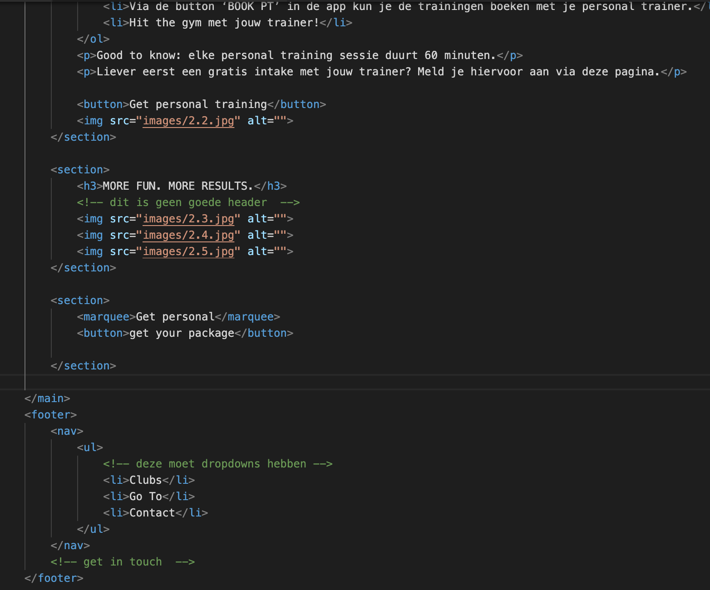

  ### Agenda voor meeting
  1e meeting ging wat anders dan de andere

  | Karenza        | Hidde              | 
  | ---            | ---                | 
  | Headers, aria  |                    | 
  | labels,        |                    | 
  | dropdown       |                    | 

  ### Verslag van meeting
  hier na afloop snel de uitkomsten van de meeting vastleggen

  - Html opzet moet netter (eerst header etc )
  - Aria lables zijn voor dingen die geen text hebben maar wel opgelezen moeten worden
  - Dropdown menus doe je met "details en summary"
  - Geen design elementen zetten in de Html (geen   en width etc)
  - Elke section moet een header hebben 

## Voortgang 2 (week 3)

  
uitwerken voor 2e voortgang

  ### Stand van zaken
  Ik had nu een begin gemaakt met css. css werkt altijd heel goed bij mij totdat het gaat om positioneren van bepaadle dingen. ik wordt echt vaak gefrustreerd met flexbos/grid dus heb daar echt even hulp bij nodig

mijn vragen: 
- @fontface 
- flexbox/grid wanneer bij het prositioneren van text kan je hier zien dat ik niet echt weet hoe en wat 

- marquee styling
- engelse woorden 
- beste alt atribute uitleg 

  ### Agenda voor meeting
  samen met je groepje opstellen

  | esra                     | Sarah               | liam                  | jornt       |
  | ---                      | ---                 | ---                   | ---              |
  | positioneren van iconen  | header img          | carrousel             |schermvulling |
  | afmetingen van afbeelding| button en img samen | nth of type lukt niet |font-weight |
  |                          | ...                 | selector positioneren |laden afb

  ### Verslag van meeting
  hier na afloop snel de uitkomsten van de meeting vastleggen

  - Je moet goed opletten op de CSS selectors en goed selecteren ander gaat het niet werken
  - Flex en grid worden voor verschillende dingen gebruikt, probeer eerst fles en dan grid

## Toegankelijkheidstest 2/2 (week 4)

  
uitwerken na test in 9e werkgroep

  ### Bevindingen
  Tijdens de test heb ik gemerkt dat ik zeker verandering zag tussen de 2 testen. De originele website was niet heel erg toegankelijk en had veel "nee's" in de test. Met mijn code en website heb ik zeker een paar verbeterpunten ingebracht. 
  hier even een lijst van wat er niet was en nu wel:
  - Een unique title 
  - Goede groote van buttons en link iconen 
  - Betere headings 
  - Lijsten zijn in ul's
  - Fotos hebben alt attributes (heeft ook de img text)
  - Focus states 
  - Button element voor buttons
  - Skip link : navigatie skippen voor screen readers 
  - Kleur contrasten verbeterd 

  Ik merk dat er wel wat dingen zijn verbeterd. en vooral dat de HTML nu wel semantisch geschreven

## Voortgang 3 (week 4)

  
uitwerken voor 3e voortgang

  ### Stand van zaken
  Ik begon mijn website met mobile first te coderen zonder goed na te denken dat het nog responsive moest zijn dus deze week had ik heel veel frustraties met responsiveness.

  mijn vragen gingen het meest over responsiveheid van text stukken
  ook had ik een vraag over het overlappen van verschillende elementen maar voorderest ging alles wel goed. Ik moest gewoon hard doorwerken aan mijn responsiveness van mijn website

  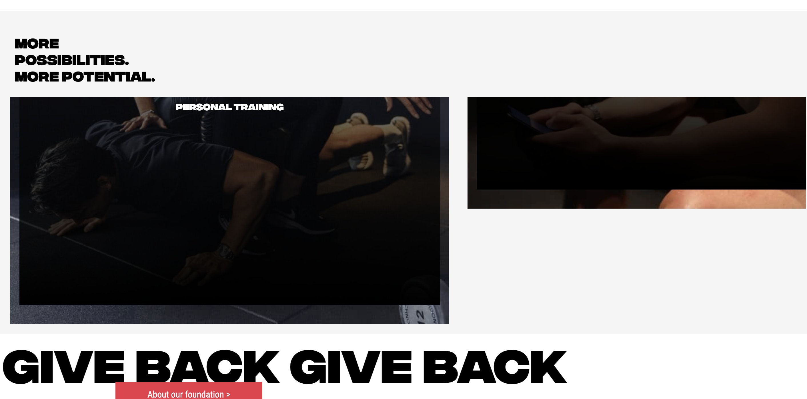

  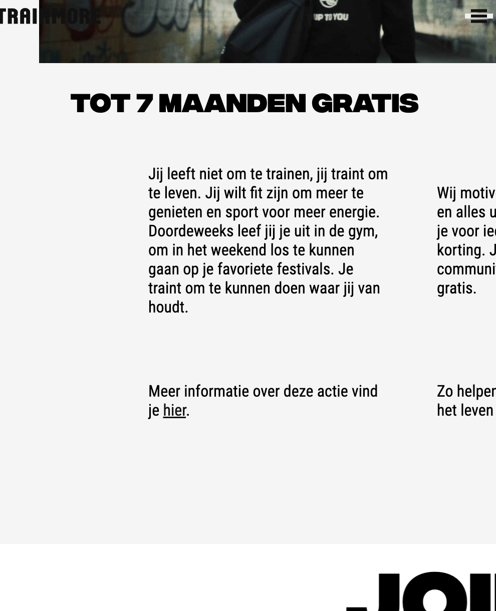

  ### Agenda voor meeting
  samen met je groepje opstellen

 Esra:
 - Ik struggle op dit moment met mijn iconen rechts krijgen in het menu. Ik wil dat het logo rechts blijft, en mijn logo links.
  - Mijn afbeelding in de eerste section is heel condensed terwijl ik wel de juiste afmetingen en afbeelding heb gebruikt.
Sarah: 
- Header images overhoop gehaald hoe fix ik het weer
- Hoe maak ik een button van een img en een woord samen
- Hoe spreek ik alleen het logo aan, laatste img van de header in de 2e nav
Liam:
- Afbeeldingen carousel met animiatie
- Nth of type voor de kleur van tekst lukt niet
- Hoe kun je het beste de iconen in de navbar doen
Jornt:
- ik wil graag weten hoezo mijn 2e section niet het scherm volledig vult.
- waarom kan ik de 'font-weight' van m'n nav niet aanpassen?
- Bepaalde afbeelding laadt niet bij testen telefoon, hoe komt dat?

  ### Verslag van meeting
  hier na afloop snel de uitkomsten van de meeting vastleggen

  - responsiveness kan je met @media maar ook met VW 
  - je mag wel divjes gebruiken voor designen (overlappen)

## Eindgesprek (week 5)

  
uitwerken voor eindgesprek

  ### Je uitkomst - karakteristiek screenshots:
  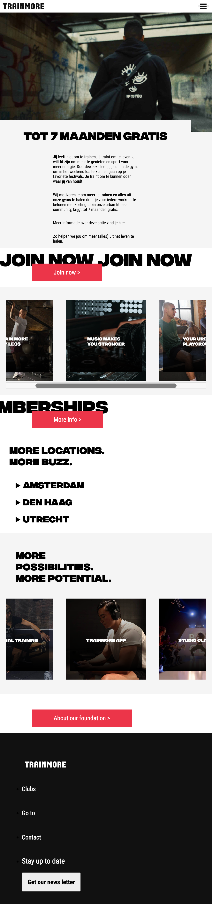

   

  ### Dit ging goed/Heb ik geleerd: 
  ik heb geleerd dat je vanaf het begin rekening moet houden met responsiveness. Ik heb de fout gemaakt dat ik voor mobile first ging coderen en moest daarna bijna mijn hele code omgooien om het responsive te maken. Dit heeft mij heel veel tijd gekost en zeker ook veel frustraties. Maar ik heb daardoor ook heel goed leren werken met code en heb er een liefde voor gevonden. Ik heb samen met de oefeningen en online dingen opzoeken echt heel veel van code geleerd en vind het frond end development nu echt heel leuk (ookal valt mijn haar er wel soms uit van frustraties ). Ik vind het dat best een mooie website is uitgekomen. Het lijkt er niet 100% op maar als je de website niet kent denk je bijna dat het de echte is (vind ik ;) )

  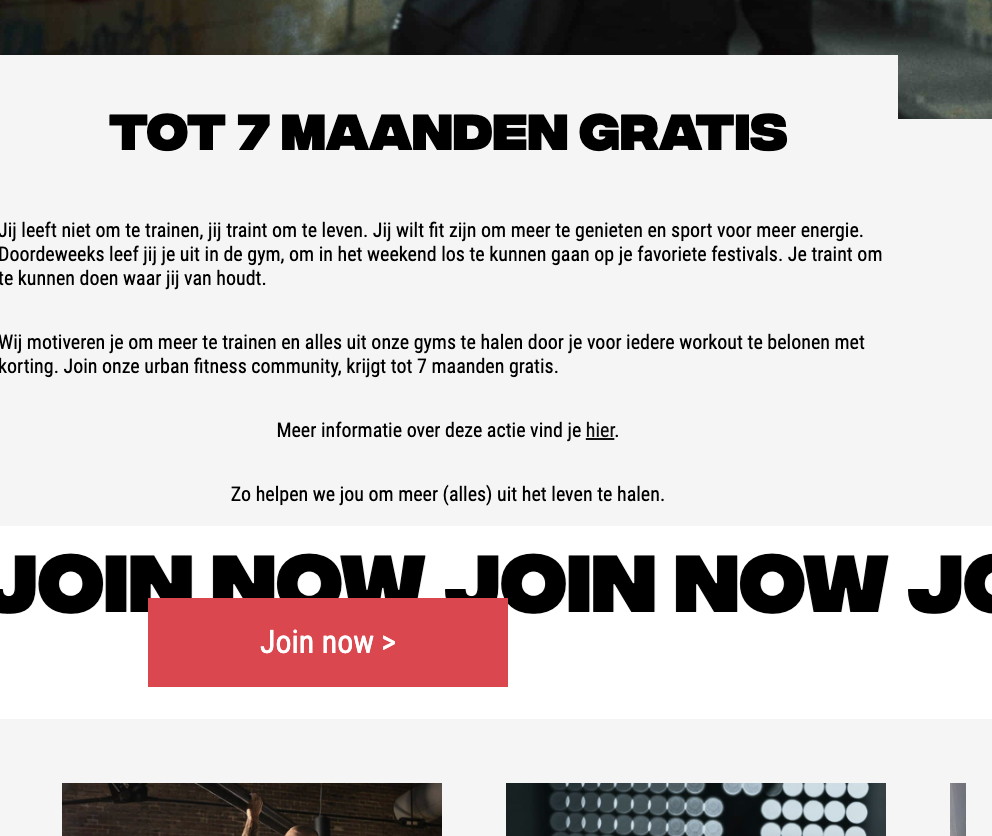

  ### Dit was lastig/Is niet gelukt:
  Sommige dingen zijn helaas niet helemaal gelukt. Je ziet bij het scrollen in de nav nog bepaalde elementen die er boven komen. daar heb ik lang mee gestruggled maar kwam er niet helemaal uit. Voorderest is de carrousel responsiveness niet helemaal wat ik had gewilt maar heb zeker wel een oplossing ervoor bedacht. 
  Als laatst was de footer ook iets waar ik lang mee zat. Helaas is de javascript van de footer niet 100% werkend 
  Ik heb wel veel van deze fouten geleerd en mij kennende ga ik na dit project nog verder om het te kunnen oplossen.

  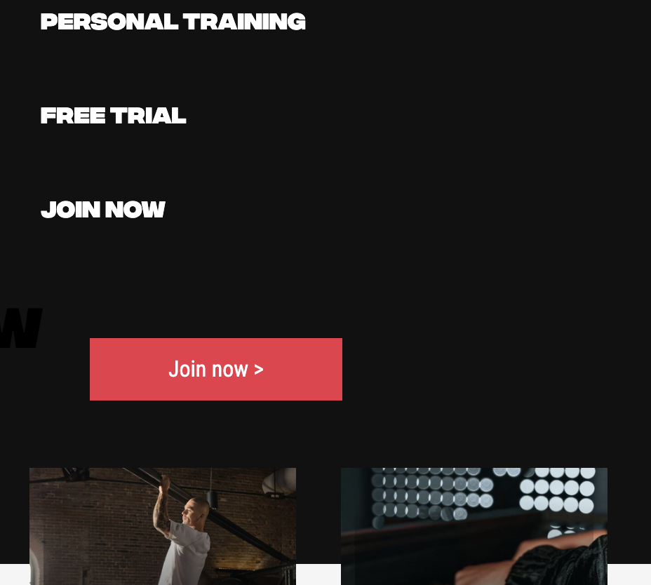
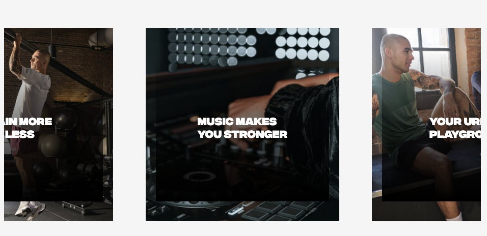
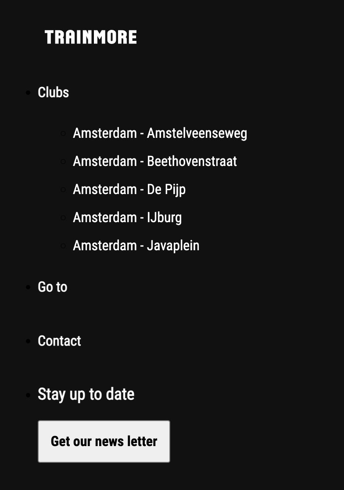

## Bronnenlijst

  
continu bijhouden terwijl je werkt

  Nb. Wees specifiek ('css-tricks' als bron is bijv. niet specifiek genoeg). 
  Nb. ChatGpT en andere AI horen er ook bij.
  Nb. Vermeld de bronnen ook in je code.

  1. bron van alle buttons: https://codepen.io/yvana/pen/XWJMKxg 

  2. bron van carrousel midden: https://codepen.io/shooft/pen/dywERGp
  3. costum cursor: https://www.freecodecamp.org/news/how-to-make-a-custom-mouse-cursor-with-css-and-javascript/
  4. Dlo oefeningen 
  5. bron chatgpt: skiplink 

